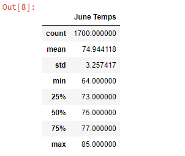

# Surfs_up

## Deliverable 1: Determine the Summary Statistics for June (40 points)
Deliverable 1 Instructions
Using Python, Pandas functions and methods, and SQLAlchemy, you’ll filter the date column of the Measurements table in the hawaii.sqlite database to retrieve all the temperatures for the month of June. You’ll then convert those temperatures to a list, create a DataFrame from the list, and generate the summary statistics.

## Deliverable 2: Determine the Summary Statistics for December (40 points)
Deliverable 2 Instructions
Using Python, Pandas functions and methods, and SQLAlchemy, you’ll filter the date column of the Measurements table in the hawaii.sqlite database to retrieve all the temperatures for the month of December. You’ll then convert those temperatures to a list, create a DataFrame from the list, and generate the summary statistics.

## Deliverable 3: A written report for the statistical analysis (20 points) ##

Deliverable 3 Instructions
For this part of the Challenge, write a report that describes the key differences in weather between June and December and two recommendations for further analysis.

The analysis should contain the following:

Overview of the analysis: Explain the purpose of this analysis.
## Results:##
 Provide a bulleted list with three major points from the two analysis deliverables. Use images as support where needed.
## Summary: ## 
Provide a high-level summary of the results and two additional queries that you would perform to gather more weather data for June and December.

### June Weather Summary
The average temperature for June in Oahu, Hi is 74.9 degrees F  
* the highest temperature observed was 85.0 degrees F
* the lowest temperature was 64 degrees F

### December Weather Summary
The average temperature for June in Oahu, Hi is 71 degrees F  
* the highest temperature observed was 83 degrees F
* the lowest temperature was 56 degrees F

